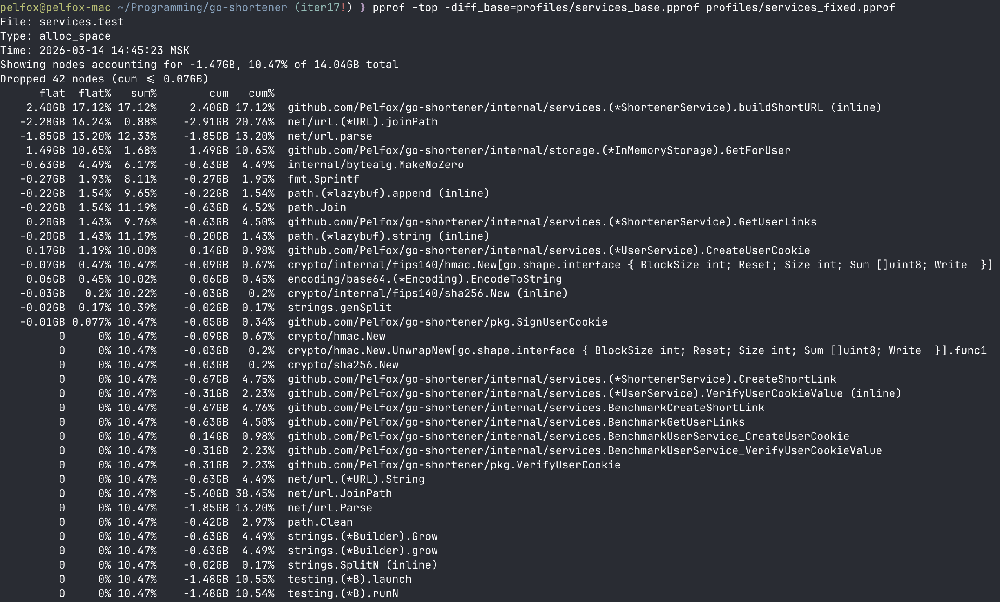
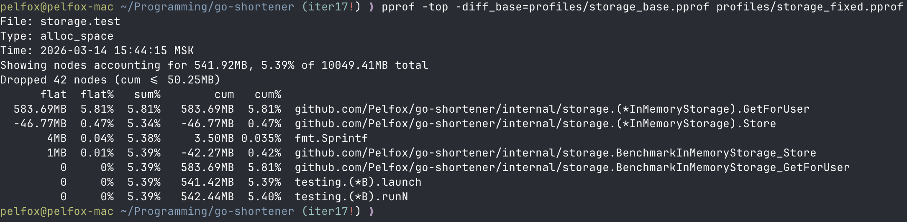

# go-shortener

Реализация сервиса сокращения ссылок. В данной ветке реализована первая итерация задания. Примеры работы программы ниже.

### Улучшение производительности

Во время реализации Инкремента №17, была улучшена производительность сервисов и
хранилища (in-memory). Результаты приведены ниже.

